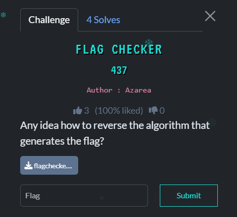

## Flag Checker - TBF1 HOLIDAY BOUNTY 2025  



- **Category:** Beginner
- **Challenge Author:** Azarea
- **Solver:** Mekakushi Dan Member No.0
- **Date:** 05/01/2026
- **Points:** 500
- **Flag:** TBF1{py7h0n_m4k3s_tr4n5f0rm50_e4sy}
- **Note:** My first solve besides sanity check :)  

## Intro  

This is the first challenge that I solved in TBF1 HOLIDAY BOUNTY 2025, this challenge is in beginner category and test us about basic reverse engineering skills. When we download the tar file, we will get an ELF file that named "flagcheckerv2".

When I meet an elf file in reverse challenge, the first thing that I do is running the file. After running the program, the program want us to input the flag that we don't have & will give output `Wrong!` after we input the wrong flag.

## Solving TIme

So, I open IDA's Decompiler to understand how the program works. I start by opening `main` so i can get a grasp of how this program work, my eyes got caught by this for loop
``` C

  for ( i = 0LL; i < v7; ++i )
  {
    v4 = sub_1185(s[i]);
    if ( v4 != byte_2020[i] )
    {
      puts("Wrong!");
      return 0LL;
    }
  }
  puts("Correct!");

```

We can see that there is some kind of work going on here, the program call `sub_1185` and assign it to v4, when we double clicked it we will get greeted by this line of code `  return (unsigned __int8)sub_1169(a1 ^ 0x67u);` here we witness a XOR operation between the value of a1 and 0x67, this code also lead to another function that is `sub_1169`, inside of `sub_1169` is a ROR 1 operation  `  return (a1 >> 1) | (a1 << 7);`. With this, we know how our input are processed, then our input is compared with `byte_2020`, what is inside that???. After I double clicked `byte_2020` inside that is bunch of byte.

```C
.rodata:0000000000002020 ; _BYTE byte_2020[35]
.rodata:0000000000002020 byte_2020       db 99h, 92h, 90h, 2Bh, 0Eh, 8Bh, 0Fh, 28h, 87h, 0ABh, 84h
.rodata:0000000000002020                                         ; DATA XREF: main+AA↑o
.rodata:000000000000202B                 db 1Ch, 5, 0A9h, 6, 2Ah, 0Ah, 1Ch, 89h, 8Ah, 0A9h, 84h
.rodata:0000000000002036                 db 29h, 80h, 0ABh, 8Ah, 5, 29h, 0ABh, 1Ch, 1, 0A9h, 0Ah
.rodata:0000000000002041                 db 0Fh, 0Dh
```

After all of the information that we gathered, finally we can start making the solver script for this flag checker challenge. I start by making a python file that named solver.py that we will use to get the flag.

```python
byte = 0x99, 0x92, 0x90, 0x2B, 0x0E, 0x8B, 0x0F, 0x28, 0x87, 0x0AB, 0x84, 0x1C, 0x5, 0x0A9, 0x6, 0x2A, 0x0A, 0x1C, 0x89, 0x8A, 0x0A9, 0x84, 0x29, 0x80, 0x0AB, 0x8A, 0x5, 0x29, 0x0AB, 0x1C, 0x1, 0x0A9, 0x0A, 0x0F, 0x0D
flag = ""
key = 0x67
for i in byte:
    i = (i << 1 & 0xff ) | (i >> 7)
    flag += chr(i ^ key)
print(flag)
```
after running this script we will get output:
```bash
dapa@LAPTOP-UUNPGJBR:/mnt/e/CTF/holidaybounty/flagchecker$ python3 solver.py
TBF1{py7h0n_m4k3s_tr4n5f0rm50_e4sy}
```
To confirm the flag is right, we need to submit the flag to the flag checker
```bash
dapa@LAPTOP-UUNPGJBR:/mnt/e/CTF/holidaybounty/flagchecker$ ./flagcheckerv2
Enter the flag: TBF1{py7h0n_m4k3s_tr4n5f0rm50_e4sy}
Correct!
```