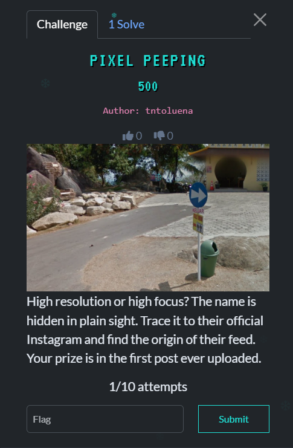
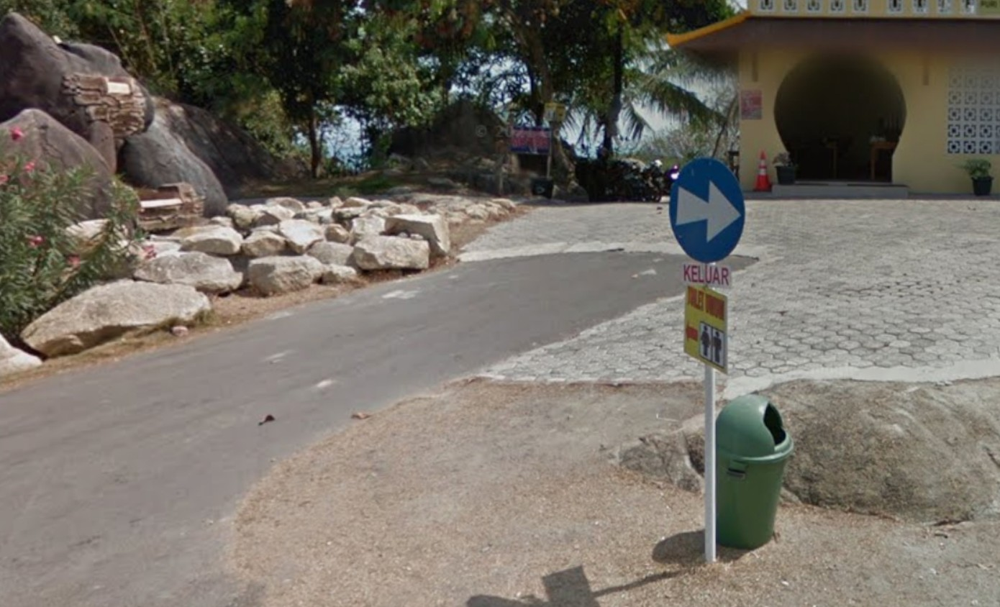
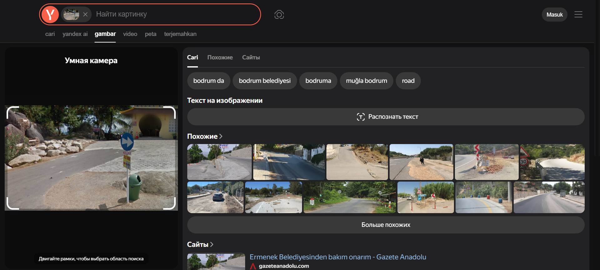
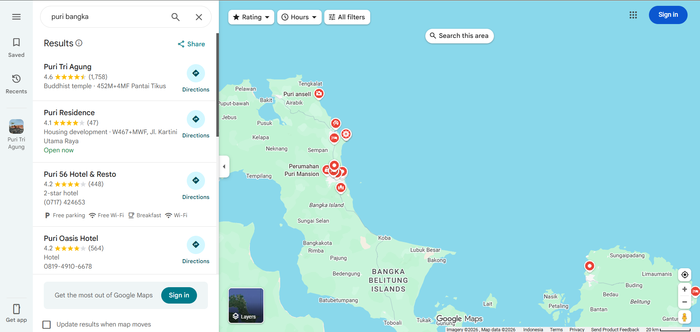
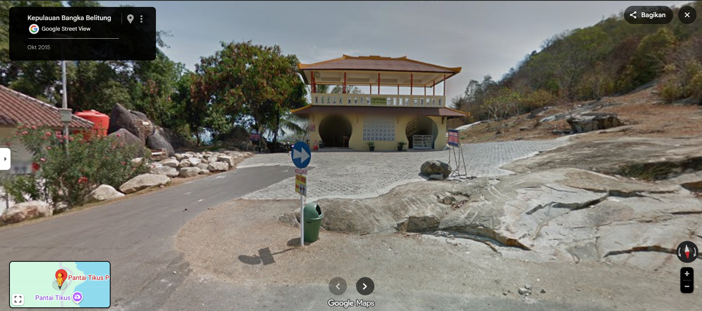

## Pixel Peeping - TBF1 HOLIDAY BOUNTY 2025  



- **Category:** OSINT
- **Challenge Author:** tntoluena
- **Solver:** Mekakushi Dan Member No.0
- **Date:** 08/01/2026
- **Points:** 500
- **Flag:** TBF1{u53_y0ur_3y3}
- **Note:** I get super duper lucky with this one

## Intro  

So, here is the provided image:
  

When i first saw this image for the first time, My first thought was a place in near beach / lowland because of the coconut tree at the background. After analyzing this image for quite time, here what I found.
```
- An exit sign in Indonesian language (so this place in Indonesia)
- Some structures of rock (granite) that scattered around at the side of the road 
- Coconut tree at the background
- Building that I thought it was religous building
```


## Stuck

I tried to search bigger detail to make me have enough information about where is this place located. But after reverse imaging in google/yandex for about 10 minutes, I didn't find anything other than a headache....., So I take a quick break.


## Solving Time??

A Miracle happen, my teammate contact me and say that there is a glimpse of hint in the top right side of the image, I quickly scan the image and find word "puri", maybe this is what pixel peeping is about :). But it is not answering where is this "puri" thing located.

I begin to search blindly in gmaps with keywords "puri", this search focused in area in Semarang because that is where this event organizer located. What I found is only housing area that have name puri in their name, not a religious site like what I want.

Maybe I need to try another method, now i try to search in google with one hint that we find earlier, that is rock formation that laying around inside the image. With keyword "granite rock formations in indonesia", here what I found:


I also have information that the author of this challenge come from the same province after ~~stalking~~ digging some information. So this information aligned with what we get earlier. Now we need to search in maps and focusing in this province. I start the search in Belitung Island, but i dont get the result that I want, so I move to Bangka Island and then here what I found:

There are place called "Puri Tri Agung" that is also religious site(in this case its Buddhist temple) after double clicked and some analysis, I found the exact place this image were captured:

It's a Cafetaria not religious site like what we assume earlier, but yeah its still has some.. I think Chinese? or maybe Buddhist vibe so yeah it is what it is.

The last thing we need to do is searching their instagram page, which is the easiest step in this challenge, scrolling through numerous post and see their firs post:

.png)

And the flag is
> TBF1{u53_y0ur_3y3}

```
another note:
Yeah I got lucky with this one, my assumption was not that right but it still lead to right place idk
```