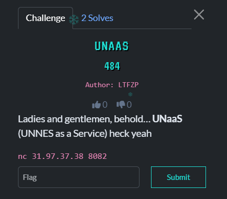

## UNAAS - TBF1 HOLIDAY BOUNTY 2025  



- **Category:** Misc
- **Challenge Author:** LTFZP
- **Solver:** Mekakushi Dan Member No.0
- **Date:** 08/01/2026
- **Points:** 484
- **Flag:** TBF1{w3_lOV3_Y0U_unNES_w3_DO}
- **Note:** Struggling at first but turns out pretty simple

## Intro

A misc challenge, with no attachments and only a netcat command, I wonder how we can get the flag if we dont have any hint in the first place....
So i ran that netcat command to get a glimpse what is inside of that and it turns out like this.

```bash
dapa@LAPTOP-UUNPGJBR:~$ nc 31.97.37.38 8082
input command: aaa
invalid command
```

So the program want us to input the right command and if not it will become like that. So how do I solve it?

## Solving Time

Honestly I didn't have much hint so I try to guessing common keywords that related to the name of the challenge like UNAAS, UNaaS, unaas, UNNES, etc. The result of that experiment is one line `invalid command`, that made me wondering how the right way to complete this challenge.

After struggling for 2-3 days, my friend found a hint,when we input either number 0 or 1 it will result new output.

```bash
dapa@LAPTOP-UUNPGJBR:~$ nc 31.97.37.38 8082
input command: 1
?
dapa@LAPTOP-UUNPGJBR:~$ nc 31.97.37.38 8082
input command: 0
?
```

This hint made me think about one possibility, a binary digit, maybe the program will accept a binary digit, but what is the correct digit. I tried this with random bit but it ended in another wall. 

After some deep thought an idea get across my head if the challenge want us to send the right "command" maybe it is not a random number, maybe this is like a type of shell that only accept a binary digit as the input, so I go to online binary encoder and type `ls` to see the list of content inside the program.

```bash
dapa@LAPTOP-UUNPGJBR:~$ nc 31.97.37.38 8082
input command: 0110110001110011
chall.py
flag.txt
```
BOOM!!!!, we can see that my input is accepted and it list all the contents inside of it, so I hurry to go to online binary encoder and use command `cat flag.txt`. Submit it and this is the result

```bash
dapa@LAPTOP-UUNPGJBR:~$ nc 31.97.37.38 8082
input command: 011000110110000101110100001000000110011001101100011000010110011100101110011101000111100001110100
TBF1{w3_lOV3_Y0U_unNES_w3_DO}
```

```
FLAG : TBF1{w3_lOV3_Y0U_unNES_w3_DO}
```