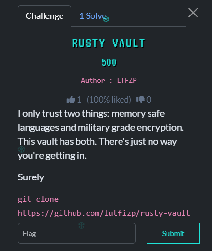
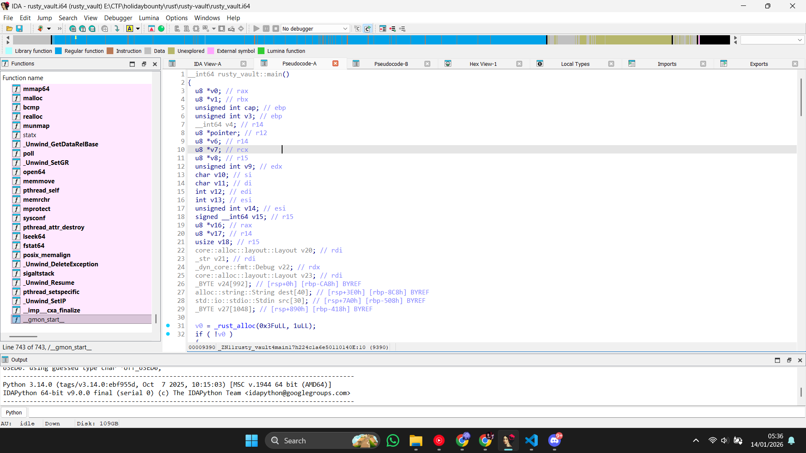

## Rusty Vault - TBF1 HOLIDAY BOUNTY 2025  



- **Category:** Reverse
- **Challenge Author:** LTFZP
- **Solver:** Mekakushi Dan Member No.0
- **Date:** 11/01/2026
- **Points:** 500
- **Flag:** TBF1{Ru5t_1s_S@f3_but_B1n@ri3s_Sp1ll_Th3_B3@ns}
- **Note:** Intimidating in the outside but pretty easy if you know the concept (im not)

## Intro

Reverse Time!!!. In this challenge we get two file that is `README.md` and `rusty_vault`. After I did a quick check with `file` we know that this `rusty_vault` file is an ELF file. When I tried to run it, we get this:
```bash
dapa@LAPTOP-UUNPGJBR:/mnt/e/CTF/holidaybounty/rust/rusty-vault$ ./rusty_vault
Enter the password to unlock the vault:
aaa
nope
```
I tried to put input `aaa` to program but it outputting `nope` to me, like it's mocking me.

## Analysis Time

I put this file in IDA's decompiler to see what is inside of this file. 

Hundred of functions flash before my eyes, fortunate i can get to function `rusty_vault::main` that contain the main code of this program, when we double clicked the function we will see how this program work, so analyzing time began. Because this program use rust, the code will look more dirty if we compared with c based program, so we didn't have to be afraid of this alien looking code.

```
After analyzing the code we get this information:
1.  The program allocated 63 (0x3F) byte memory in v0 to store the encrypted flag, this 63 byte is coming from this lines of code   
    *(_OWORD *)v0 = xmmword_50000;
    *((_OWORD *)v0 + 1) = xmmword_50010;
    *((_OWORD *)v0 + 2) = xmmword_50020;
    *((_QWORD *)v0 + 6) = 0x86EA63EE49546802LL;
    *((_DWORD *)v0 + 14) = -322522767;
    *((_WORD *)v0 + 30) = 11626;
    v0[62] = -41;

2. This program is using AES-GCM to encrypt the flag
3. The key for this program is come from unk_50077 
4. The Nonce is come from unk_5006B and the content is 0F4h 
5. After the program take and encrypt your input, it will be compared with the ciphertext, if its same, then its the right flag
```

## Solving Time

We need to extract three things, the ciphertext, key and nonce to make the solver and get the flag.

``` python
## in the solver it will look like this
import struct
from Crypto.Cipher import AES
def solve():
    ## The Key we get from unk_50077
    key = bytes([0x0D, 0x7E, 0x92, 0x28, 0xC7, 0x64, 0x7C, 0x98, 
            0xAB, 0x41, 0x27, 0x39, 0x7A, 0x85, 0x73, 0xE7,
            0xE9, 0x38, 0xE6, 0x31, 0x1B, 0x8C, 0x86, 0x32, 
            0xE8, 0x93, 0x06, 0x1C, 0x1C, 0x68, 0xB3, 0xED]) 
    ## The Nonce we get from unk_5006B
    NONCE = bytes([0xF4, 0xB9, 0x00, 0x92, 0x27, 0xB0, 0x18, 0xCC, 
            0x92, 0x05, 0x89, 0x6F]) 
    ## xmmword_50000
    cipher1 = bytes.fromhex("7F2F8E0EC6030A63AF7076A98E6635E3")[::-1]       
    ## xmmword_50010
    cipher2 = bytes.fromhex("5D35274B1A36CCBDA24190FA6406BAF7")[::-1]
    ## xmmword_50020       
    cipher3 = bytes.fromhex("25D8085FBBFAAE808B1B9CDE4C80966E")[::-1]       
    cipher4 = struct.pack('<Q', 0x86EA63EE49546802)
    cipher5 = struct.pack('<i', -322522767)
    cipher6 = struct.pack('<H',11626)
    cipher7 = struct.pack('<b', -41)
    ## Reconstruct the full cipher blob
    fullcipher = cipher1+cipher2+cipher3+cipher4+cipher5+cipher6+cipher7 
    
```

So basically in this part of code we prepare all the material needed for our decryptor, here we use struct library to convert our cipher into little endian formatted bytes, we also use struct not only for formatting but also to handle negative values (like -41) easily using Two's Complement representation, here we also reverse the bytes order for the data from xmmword because IDA reads it as 128-bit integer. The last thing we do is combining the cipher from cipher1 to cipher7.

`quick note: XMMWORD Used for 128-bit multimedia operands with MMX and SSE (XMM) instructions..`

Now comes the decrypting part

```python
    try:
        tag = fullcipher[-16:]
        ciphertext = fullcipher[:-16]
        cipher = AES.new(key, AES.MODE_GCM, nonce=NONCE)  
        dec = cipher.decrypt_and_verify(ciphertext, tag)      
        print("Flag :")
        print(dec.decode('utf-8'))
    except Exception as e:
        print(f"\nError{e}")
        
        
    
if __name__ == "__main__":
    solve()
```

The fullcipher then divided into two part, `tag` for the last 16 bytes in fullcipher  and `ciphertext` for the rest of the bytes. I found pretty much same decrypting script in stackoverflow so I used it and when we run the script

```bash
##FLAG
Flag :TBF1{Ru5t_1s_S@f3_but_B1n@ri3s_Sp1ll_Th3_B3@ns
```

```url
reference:
https://learn.microsoft.com/en-us/cpp/assembler/masm/xmmword?view=msvc-170
https://stackoverflow.com/questions/67307689/decrypt-an-encrypted-message-with-aes-gcm-in-python

```